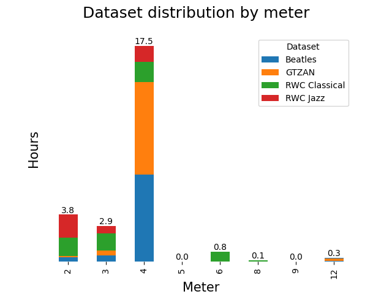
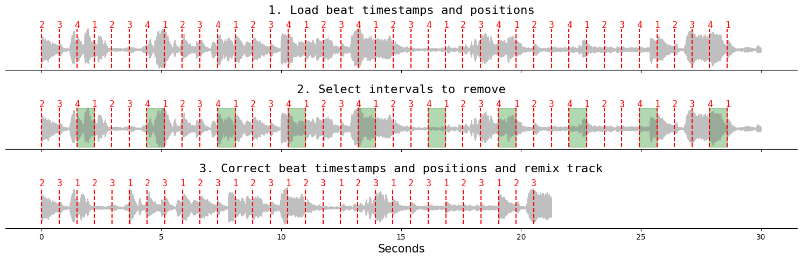
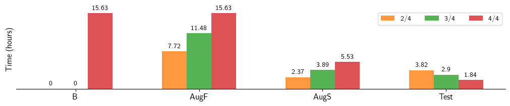

---
# Feel free to add content and custom Front Matter to this file.
# To modify the layout, see https://jekyllrb.com/docs/themes/#overriding-theme-defaults

layout: home
---

<h1 style="text-align:center;">Skip That Beat: Augmenting Meter Tracking Models for Underrepresented Time Signatures</h1>

  

  <h2 style="text-align:center;">Giovana Morais MARL</h2>
  

  

  <h2 style="text-align:center;">Brian McFee MARL-CDS</h2>
  

  

  <h2 style="text-align:center;">Magdalena Fuentes MARL-IDM</h2>
  

| [Paper]() | [Demo](https://giovana-morais.github.io/skip_that_beat_demo) | [Code](https://github.com/giovana-morais/skip_that_beat) |

## Abstract

Beat and downbeat tracking models are predominantly developed using datasets with music in 4/4 meter, which decreases their generalization to repertories in other time signatures, such as Brazilian samba which is in 2/4. In this work, we propose a simple augmentation technique to increase the representation of time signatures beyond 4/4, namely 2/4 and 3/4. Our augmentation procedure works by removing beat intervals from 4/4 annotated tracks. We show that the augmented data helps to improve downbeat tracking for underrepresented meters while preserving the overall performance of beat tracking in two different models. We also show that this technique helps improve downbeat tracking in an unseen samba dataset.

# Augmentation Examples

## Augmentation Procedure

## Beatles

  

  <h3>Original (4/4)</h3>
  <audio controls class="player">
    <source src="media/audio/0601.wav" type="audio/wav">
  </audio>
  <audio controls class="player">
    <source src="media/audio/1115.wav" type="audio/wav">
  </audio>
  <audio controls class="player">
    <source src="media/audio/0801.wav" type="audio/wav">
  </audio>
  

  

  <h3>Augmented (2/4)</h3>
  <audio controls class="player">
    <source src="media/audio/0601_24.wav" type="audio/wav">
  </audio>
  <audio controls class="player">
    <source src="media/audio/1115_24.wav" type="audio/wav">
  </audio>
  <audio controls class="player">
    <source src="media/audio/0801_24.wav" type="audio/wav">
  </audio>
  

  

  <h3>Augmented (3/4)</h3>
  <audio controls class="player">
    <source src="media/audio/0601_34.wav" type="audio/wav">
  </audio>
  <audio controls class="player">
    <source src="media/audio/1115_34.wav" type="audio/wav">
  </audio>
  <audio controls class="player">
    <source src="media/audio/0801_34.wav" type="audio/wav">
  </audio>
  

 

## GTZAN

  

  <h3>Original (4/4)</h3>
  <audio controls class="player">
    <source src="media/audio/pop.00001.wav" type="audio/wav">
  </audio>
  <audio controls class="player">
    <source src="media/audio/blues.00009.wav" type="audio/wav">
  </audio>
  <audio controls class="player">
    <source src="media/audio/country.00044.wav" type="audio/wav">
  </audio>
  <audio controls class="player">
    <source src="media/audio/reggae.00071.wav" type="audio/wav">
  </audio>
  

  

  <h3>Augmented (2/4)</h3>
  <audio controls class="player">
    <source src="media/audio/pop.00001_24.wav" type="audio/wav">
  </audio>
  <audio controls class="player">
    <source src="media/audio/blues.00009_24.wav" type="audio/wav">
  </audio>
  <audio controls class="player">
    <source src="media/audio/country.00044_24.wav" type="audio/wav">
  </audio>
  <audio controls class="player">
    <source src="media/audio/reggae.00071_24.wav" type="audio/wav">
  </audio>
  

  

  <h3>Augmented (3/4)</h3>
  <audio controls class="player">
    <source src="media/audio/pop.00001_34.wav" type="audio/wav">
  </audio>
  <audio controls class="player">
    <source src="media/audio/blues.00009_34.wav" type="audio/wav">
  </audio>
  <audio controls class="player">
    <source src="media/audio/country.00044_34.wav" type="audio/wav">
  </audio>
  <audio controls class="player">
    <source src="media/audio/reggae.00071_34.wav" type="audio/wav">
  </audio>
  

 

## RWC Jazz

  

  <h3>Original (4/4)</h3>
  <audio controls class="player">
    <source src="media/audio/RM-J050.wav" type="audio/wav">
  </audio>
  <audio controls class="player">
    <source src="media/audio/RM-J039.wav" type="audio/wav">
  </audio>
  <audio controls class="player">
    <source src="media/audio/RM-J022.wav" type="audio/wav">
  </audio>
  

  

  <h3>Augmented (2/4)</h3>
  <audio controls class="player">
    <source src="media/audio/RM-J050_24.wav" type="audio/wav">
  </audio>
  <audio controls class="player">
    <source src="media/audio/RM-J039_24.wav" type="audio/wav">
  </audio>
  <audio controls class="player">
    <source src="media/audio/RM-J022_24.wav" type="audio/wav">
  </audio>
  

  

  <h3>Augmented (3/4)</h3>
  <audio controls class="player">
    <source src="media/audio/RM-J050_34.wav" type="audio/wav">
  </audio>
  <audio controls class="player">
    <source src="media/audio/RM-J039_34.wav" type="audio/wav">
  </audio>
  <audio controls class="player">
    <source src="media/audio/RM-J022_34.wav" type="audio/wav">
  </audio>
  

 

## RWC Classical

  

  <h3>Original (4/4)</h3>
  <audio controls class="player">
    <source src="media/audio/RM-C008.wav" type="audio/wav">
  </audio>
  <audio controls class="player">
    <source src="media/audio/RM-C030.wav" type="audio/wav">
  </audio>
  <audio controls class="player">
    <source src="media/audio/RM-C028.wav" type="audio/wav">
  </audio>
  

  

  <h3>Augmented 2/4</h3>
  <audio controls class="player">
    <source src="media/audio/RM-C008_24.wav" type="audio/wav">
  </audio>
  <audio controls class="player">
    <source src="media/audio/RM-C030_24.wav" type="audio/wav">
  </audio>
  <audio controls class="player">
    <source src="media/audio/RM-C028_24.wav" type="audio/wav">
  </audio>
  

  

  <h3>Augmented (3/4)</h3>
  <audio controls class="player">
    <source src="media/audio/RM-C008_34.wav" type="audio/wav">
  </audio>
  <audio controls class="player">
    <source src="media/audio/RM-C030_34.wav" type="audio/wav">
  </audio>
  <audio controls class="player">
    <source src="media/audio/RM-C028_34.wav" type="audio/wav">
  </audio>
  

 
## Training Data Distribution

# Complete Results

## BayesBeat

**Beat evaluation (Test set)**

|     | training data | F     | CMLc  | CMLt  | AMLc  | AMLt  |
|-----|---------------|-------|-------|-------|-------|-------|
| 2/4 | B             | 0.582 | 0.241 | 0.322 | 0.509 | 0.679 |
|     | AugF          | 0.573 | 0.223 | 0.298 | 0.529 | 0.696 |
|     | AugS          | 0.580 | 0.259 | 0.323 | 0.526 | 0.698 |
| 3/4 | B             | 0.608 | 0.344 | 0.444 | 0.455 | 0.644 |
|     | AugF          | 0.642 | 0.390 | 0.588 | 0.502 | 0.688 |
|     | AugS          | 0.631 | 0.388 | 0.489 | 0.496 | 0.679 |
| 4/4 | B             | 0.842 | 0.673 | 0.714 | 0.826 | 0.882 |
|     | AugF          | 0.842 | 0.673 | 0.714 | 0.826 | 0.883 |
|     | AugS          | 0.817 | 0.644 | 0.683 | 0.810 | 0.872 |

**Downbeat evaluation (Test Set)**

|     | training data | F     | CMLc  | CMLt  | AMlc  | AMLt  |
|-----|---------------|-------|-------|-------|-------|-------|
| 2/4 | B             | 0.376 | 0.182 | 0.218 | 0.407 | 0.484 |
|     | AugF          | 0.401 | 0.202 | 0.242 | 0.408 | 0.488 |
|     | AugS          | 0.418 | 0.182 | 0.213 | 0.422 | 0.517 |
| 3/4 | B             | 0.193 | 0.032 | 0.047 | 0.068 | 0.130 |
|     | AugF          | 0.424 | 0.313 | 0.345 | 0.401 | 0.480 |
|     | AugS          | 0.293 | 0.076 | 0.087 | 0.151 | 0.188 |
| 4/4 | B             | 0.609 | 0.559 | 0.572 | 0.782 | 0.798 |
|     | AugF          | 0.602 | 0.464 | 0.477 | 0.745 | 0.764 |
|     | AugS          | 0.512 | 0.282 | 0.292 | 0.613 | 0.631 |

**BRID: Beat and Downbeat evaluation**

|          | training data | F     | CMLc  | CMLt  | AMLc  | AMLt  |
|----------|---------------|-------|-------|-------|-------|-------|
| Beat     | B             | 0.612 | 0.147 | 0.151 | 0.690 | 0.709 |
|          | AugF          | 0.606 | 0.147 | 0.150 | 0.689 | 0.703 |
|          | AugS          | 0.575 | 0.124 | 0.127 | 0.627 | 0.644 |
| Downbeat | B             | 0.068 | 0.069 | 0.072 | 0.272 | 0.275 |
|          | AugF          | 0.137 | 0.007 | 0.007 | 0.253 | 0.275 |
|          | AugS          | 0.224 | 0.030 | 0.038 | 0.126 | 0.160 |

 

## TCN-PP

**Beat evaluation (Test set)**

|     | training data | F     | CMLc  | CMLt  | AMLc  | AMLt  |
|-----|---------------|-------|-------|-------|-------|-------|
| 2/4 | B             | 0.553 | 0.030 | 0.090 | 0.231 | 0.417 |
|     | AugF          | 0.547 | 0.029 | 0.105 | 0.189 | 0.382 |
|     | AugS          | 0.526 | 0.022 | 0.084 | 0.164 | 0.366 |
| 3/4 | B             | 0.680 | 0.167 | 0.392 | 0.220 | 0.498 |
|     | AugF          | 0.706 | 0.244 | 0.451 | 0.288 | 0.530 |
|     | AugS          | 0.672 | 0.181 | 0.385 | 0.236 | 0.501 |
| 4/4 | B             | 0.848 | 0.495 | 0.618 | 0.602 | 0.752 |
|     | AugF          | 0.877 | 0.567 | 0.694 | 0.635 | 0.777 |
|     | AugS          | 0.831 | 0.464 | 0.586 | 0.573 | 0.722 |

**Downbeat evaluation (Test Set)**

|     | training data | F     | CMLc  | CMLt  | AMLc  | AMLt  |
|-----|---------------|-------|-------|-------|-------|-------|
| 2/4 | B             | 0.352 | 0.003 | 0.012 | 0.040 | 0.097 |
|     | AugF          | 0.357 | 0.002 | 0.012 | 0.040 | 0.125 |
|     | AugS          | 0.328 | 0.002 | 0.010 | 0.035 | 0.091 |
| 3/4 | B             | 0.349 | 0.000 | 0.002 | 0.194 | 0.250 |
|     | AugF          | 0.369 | 0.001 | 0.003 | 0.275 | 0.335 |
|     | AugS          | 0.341 | 0.000 | 0.001 | 0.208 | 0.254 |
| 4/4 | B             | 0.369 | 0.000 | 0.000 | 0.103 | 0.122 |
|     | AugF          | 0.361 | 0.000 | 0.000 | 0.051 | 0.070 |
|     | AugS          | 0.324 | 0.000 | 0.000 | 0.014 | 0.019 |

<!-- **Beat evaluation (BRID)** -->

<!-- **Downbeat evaluation (BRID)** -->

 

## TCN-DBN

**Beat evaluation (Test set)**

|     | training data | F     | CMLc  | CMLt  | AMLc  | AMLt  |
|-----|---------------|-------|-------|-------|-------|-------|
| 2/4 | B             | 0.643 | 0.321 | 0.425 | 0.522 | 0.715 |
|     | AugF          | 0.641 | 0.373 | 0.482 | 0.525 | 0.704 |
|     | AugS          | 0.571 | 0.251 | 0.337 | 0.439 | 0.611 |
| 3/4 | B             | 0.716 | 0.472 | 0.606 | 0.548 | 0.720 |
|     | AugF          | 0.720 | 0.475 | 0.629 | 0.539 | 0.737 |
|     | AugS          | 0.723 | 0.499 | 0.665 | 0.539 | 0.728 |
| 4/4 | B             | 0.900 | 0.786 | 0.827 | 0.887 | 0.933 |
|     | AugF          | 0.906 | 0.810 | 0.855 | 0.891 | 0.945 |
|     | AugS          | 0.877 | 0.740 | 0.777 | 0.858 | 0.914 |

**Downbeat evaluation (Test Set)**

|     | training data | F     | CMLc  | CMLt  | AMLc  | AMLt  |
|-----|---------------|-------|-------|-------|-------|-------|
| 2/4 | B             | 0.447 | 0.041 | 0.067 | 0.377 | 0.482 |
|     | AugF          | 0.439 | 0.024 | 0.046 | 0.400 | 0.507 |
|     | AugS          | 0.389 | 0.023 | 0.044 | 0.297 | 0.382 |
| 3/4 | B             | 0.422 | 0.035 | 0.051 | 0.616 | 0.669 |
|     | AugF          | 0.410 | 0.014 | 0.025 | 0.617 | 0.676 |
|     | AugS          | 0.403 | 0.015 | 0.024 | 0.615 | 0.674 |
| 4/4 | B             | 0.353 | 0.000 | 0.000 | 0.023 | 0.025 |
|     | AugF          | 0.371 | 0.000 | 0.000 | 0.045 | 0.050 |
|     | AugS          | 0.347 | 0.000 | 0.000 | 0.058 | 0.061 |

<!-- **Beat evaluation (BRID)** -->
<!-- **Downbeat evaluation (BRID)** -->

 

## Cite
